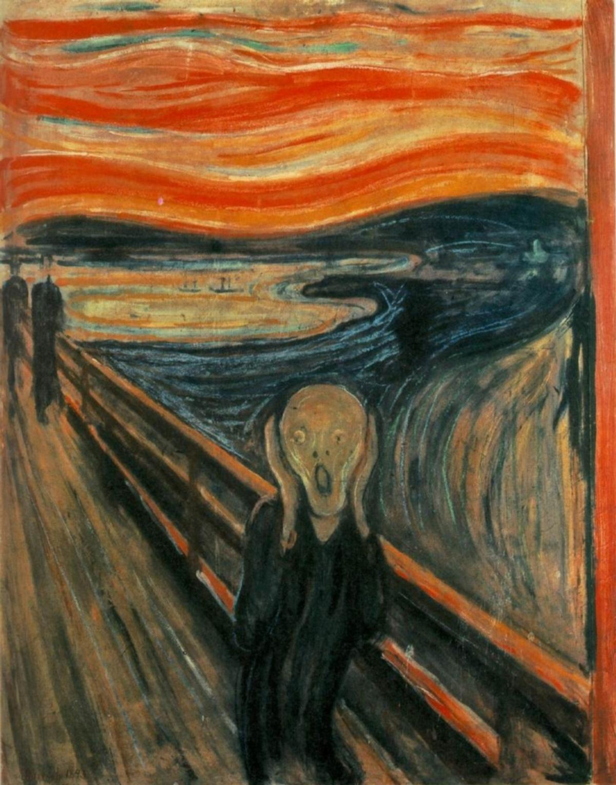
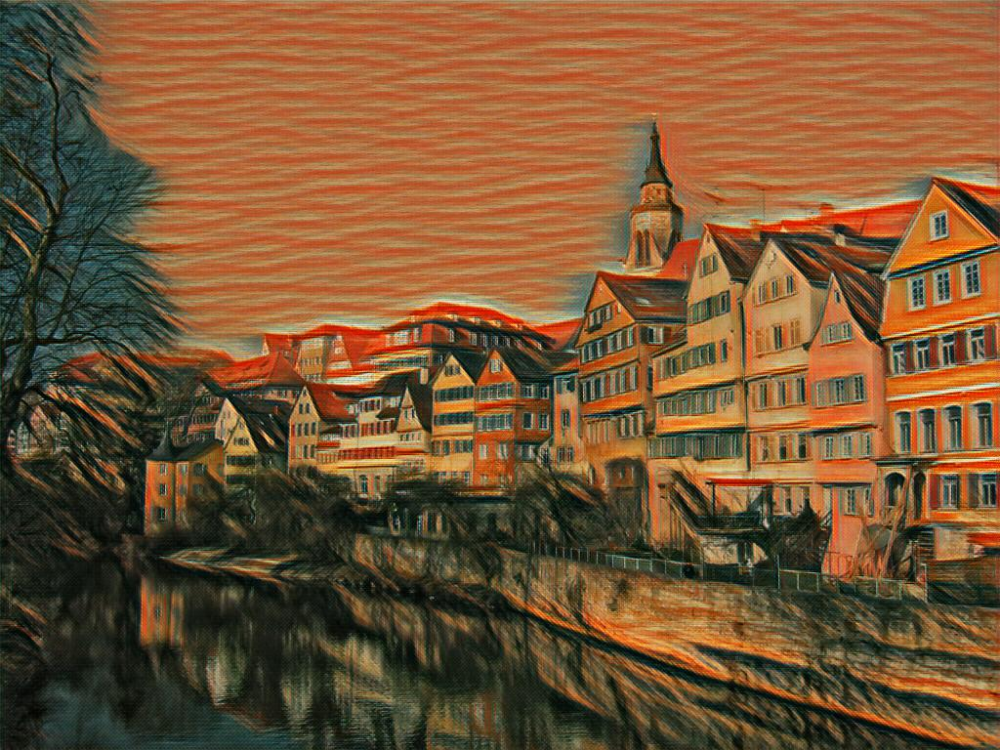

# fast-neural-style

Reproduce the work by this paper ["Perceptual Losses for Real-Time Style Transfer and Super-Resolution" (Johnson et al., ECCV 2016)](http://www.cv-foundation.org/openaccess/content_cvpr_2016/papers/Gatys_Image_Style_Transfer_CVPR_2016_paper.pdf).

## the steps to success:
1. Understand and implement style transfer [assignment for cs231n](http://cs231n.github.io/assignments2017/assignment3/).
2. Replace [squeezenet](https://github.com/zhangguobin/cs231n/blob/master/assignment3/cs231n/classifiers/squeezenet.py) with [tf.slim.vgg](https://github.com/tensorflow/models/blob/master/research/slim/nets/vgg.py) as feature extractor.
3. Tried to replace tf.slim.vgg with [tf.keras.vgg](https://github.com/tensorflow/tensorflow/blob/master/tensorflow/python/keras/applications/vgg16.py) directly, does not work. Then I took a step back, manually reinvented the tf.keras.vgg with tf.layers, and managed to loaded the weights from trained keras models.
4. Reuse tf.keras.vgg directly, instead of reinvented copy, thanks to [a blog by Zach Moshe](http://zachmoshe.com/2017/11/11/use-keras-models-with-tf.html).
5. I spent days on tunning to get similar results in the paper, the main error I made is the ignorance of difference in preprocessing due to the difference between squeezenet and vgg models.
6. Implement [fast style transfer](https://github.com/jcjohnson/fast-neural-style) with tensorflow based on previous codes and the paper above.
7. Got stuck in hypterparameter tunning for WEEKS, due to bad setup of style layers {relu1_2, relu2_2, relu3_3, relu4_3}, I wasted weeks on trying SGD vs Adam, learning rates, content/style weights. I did learn a lot, e.g. Tensorboard. Then I given up and check the differences in others' solutions: [OlavHN](https://github.com/OlavHN/fast-neural-style), [lengstrom](https://github.com/lengstrom/fast-style-transfer) and [hwalsuklee](https://github.com/hwalsuklee/tensorflow-fast-style-transfer), quickly I found the right settings {relu1_1, relu2_1, relu3_1, relu4_1}.
8. Refactor IPython version to python scripts, it's easy.

## Example

  
  
  

